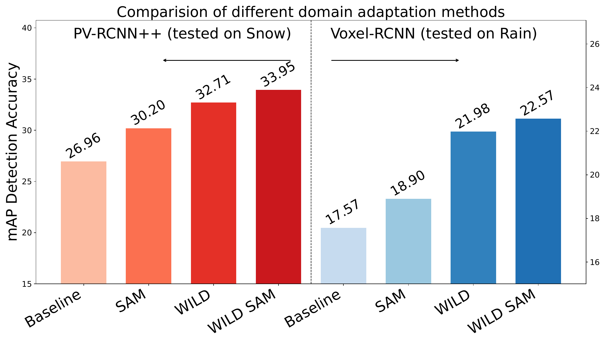

[](https://www.egr.msu.edu/waves/)

# WILD SAM: Simulated-and-Real Data Augmentation for Autonomous Driving Perception

`WILD SAM` is an advanced 3D object detection framework built upon the [`OpenPCDet`](https://github.com/open-mmlab/OpenPCDet) codebase. It is specifically designed to enhance perception robustness in autonomous driving systems operating under challenging weather conditions (snow, rain) through a novel simulated-and-real data augmentation strategy.

**Official Implementation of:**
> [**WILD SAM: A Simulated-and-Real Data Augmentation for Autonomous Driving Perception under Challenging Weather**](https://arxiv.org/abs/2605.01081)  
> *Hamed Khatounabadi, Xiaohu Lu, Hayder Radha* > **IEEE Intelligent Vehicles (IV) 2026**

---

## Highlights
* **Hybrid Augmentation:** Integrates real-world data with physics-based simulation [(LISA)](https://github.com/velatkilic/LISA) and Ray casting model [(DALI)](https://github.com/xiaohulugo/T-RO2024-DALI/blob/main/tools/ppcg_points.py). Thanks to their excellent work!



---

## Installation

`WILD SAM` inherits the requirements of `OpenPCDet`. Please refer to the [Installation Guide](docs/INSTALL.md) for environment setup, including `PyTorch`, `spconv`, and the Other required packages.

To clone this repository (including all submodules such as DALI and LISA), use:

```
git clone --recurse-submodules https://github.com/Kh-Hamed/WILD-SAM

```

## Dataset Preparation (MSU FourSeasons)

The project utilizes the **[MSU-4s (FourSeasons)](https://openaccess.thecvf.com/content/CVPR2024/papers/Kent_MSU-4S_-_The_Michigan_State_University_Four_Seasons_Dataset_CVPR_2024_paper.pdf)** dataset. Follow these steps to prepare the data and generate the ground-truth databases.

### 1. Initial Configuration
Download the [MSU-4S dataset](https://www.egr.msu.edu/waves/msu4s/).
And, place in the below directory (for exmaple for the 2023_summer):
```
data/fourseason/ImageSets/2023_late_summer_5min_balanced/
├── label3d/
│   ├── [label files(*.yaml)]
├── oust/
│   ├── [LiDAR files(*.oust)]
├── train.txt
├── val.txt
```

 Update your local paths in:  
[`tools/cfgs/dataset_configs/fourseason_dataset.yaml`](tools/cfgs/dataset_configs/fourseason_dataset.yaml)

Specifically, verify the following fields:
* [`DATA_PATH`](tools/cfgs/dataset_configs/fourseason_dataset.yaml#L3) : root path/to_your/train and val.txt
* [`PATH_LIDAR`](tools/cfgs/dataset_configs/fourseason_dataset.yaml#L4) :root path/to_your/downloaded MSU lidar files
* [`PATH_LABEL`](tools/cfgs/dataset_configs/fourseason_dataset.yaml#L5): root path/to_your/downloaded MSU label (annotation) files

### 2. Generate Data 
You must generate metadata Infos (pickle files) for the base MSU-FS dataset, as well as the LISA and DALI augmented sets.

#### **A. MSU-FS Infos and Database**
Edit [`pcdet/datasets/fourseason/fourseason_dataset.py`](pcdet/datasets/fourseason/fourseason_dataset.py):
1. Set [`--cfg_file`](pcdet/datasets/fourseason/fourseason_dataset.py#L613) to your [dataset confing address](tools/cfgs/dataset_configs/fourseason_dataset.yaml).
2. Run the generation script with [`--func create_fs_infos`](pcdet/datasets/fourseason/fourseason_dataset.py#L614).
3. Set [`ROOT_DIR`](pcdet/datasets/fourseason/fourseason_dataset.py#L626) to your dataset ImageSets path.

After setting pathes, run [`pcdet/datasets/fourseason/fourseason_dataset.py`](pcdet/datasets/fourseason/fourseason_dataset.py)


You should have following directory structure:

```
data/fourseason/ImageSets/2023_late_summer_5min_balanced/
├── label3d/
│   ├── [label files(*.yaml)]
├── oust/
│   ├── [LiDAR files(*.oust)]
├── fs_gt_database_train_sampled_1/
│   ├── [binary object files(*.bins)]
├── fs_infos_train.pkl
├── fs_infos_train.pkl
├── fs_infos_val.pkl
├── fs_dbinfos_train_sampled_1.pkl
├── train.txt
├── val.txt
```

Please do the same process for other seasons like rain/snow, download them and follow similar steps like summer.

#### **B. LISA & DALI Infos and Database**
##### **WILD frames:**

Follow the same procedure for simulated data:
For gernation of WILD frames using DALI, go to [DALI/tools/ppcg_points.py](DALI/tools/ppcg_points.py):

First, we should generate dense source samples. So, go to [DALI/tools/cfgs/dataset_configs/fourseason_dataset.yaml](DALI/tools/cfgs/dataset_configs/fourseason_dataset.yaml) and change addresses to summer dwonloaded point clouds and labels and train.txt files. (as you geenrated in [MSU-FS Infos and Database](README.md#L54))

Then, go line [749](DALI/tools/ppcg_points.py#L749) and make sure condition is true, and run generate_source_db funtion. After this inside the source_dbinfo_path your directory should be like this:
```
source_dbinfo_path = 'saving/path/to/your/dense summer samples & generated denoised point clouds and pseudo lables'
for exmaple:

source_dbinfo_path = 'data/DALI/DALI_simulation'
source_dbinfo_path/
├── objects/
│   ├── [dense summer sample files(*.npy)]
├── dbinfo.pkl
```

Now, you have dense source samples and ready to denoise the pseudo labels on the target domain(snow/rain). Change the [model config file address](DALI/tools/ppcg_points.py#L66) to PV-RCNN++/Voxel-RCNN yaml file
```
for exmaple:
args.cfg_file = DALI/tools/cfgs/FS_models/pv_rcnn_plusplus.yaml
```
change the [address of source pre-trained model ckpt file](DALI/tools/ppcg_points.py#L69) to  our summer pre-trained PV-RCNN++/Voxel-RCNN checkpoints file. 

```
for exmaple:
args.ckpt  = path/to_your_downloded_pretrained_check_point_model
```

You can download from here:

[PV-RCNN++](https://drive.google.com/file/d/1u2yX0kNxElYwg_RyNl1xV_rdOKN4eOwj/view?usp=drive_link)

[Voxel-RCNN](https://drive.google.com/file/d/1F3Q0d7bh9qA8oM-WMH42OU_LFnURZR3T/view?usp=drive_link)


Then, for exmaple for [pv_rcnn_plusplus.yaml](DALI/tools/cfgs/FS_models/pv_rcnn_plusplus.yaml), change the base address to MSU-FS dataset, specifiaclly:
* [`_BASE_CONFIG_`](DALI/tools/cfgs/FS_models/pv_rcnn_plusplus.yaml#L5) : root path/to_your/[fourseason_dataset.yaml](DALI/tools/cfgs/dataset_configs/fourseason_dataset.yaml)
* [`DATA_PATH`](DALI/tools/cfgs/FS_models/pv_rcnn_plusplus.yaml#L10): root path/to_your/downloaded MSU harsh weather(snow/rain) txt files 
* [`PATH_LIDAR`](DALI/tools/cfgs/FS_models/pv_rcnn_plusplus.yaml#L11): root path/to_your/downloaded MSU lidar files of targeting harsh weather(snow/rain) 


Then, go line [749](DALI/tools/ppcg_points.py#L749) and make sure condition is false, chnage the source_dbinfo_path path like below, and run RC_PPCG funtion:

```
source_dbinfo_path = 'saving/path/to/your/dense summer samples & generated denoised point clouds and pseudo lables'
for exmaple:

source_dbinfo_path = 'data/DALI/DALI_simulation'
```

After this your directory shoudl be like this:
```
source_dbinfo_path = 'data/DALI/DALI_simulation'
source_dbinfo_path/
├── objects/
│   ├── [dense summer sample files(*.npy)]
├── lidar/
│   ├── [rain/snowy target denoised point clouds(*.npy)]
├── label/
│   ├── [rain/snowy target pseudo lables(*.npy)]
├── dbinfo.pkl
```

For gerating the databse for the WILD frames similar to MSU-FS pickle files, use [pcdet/datasets/fourseason/fourseason_dataset_DALI.py](pcdet/datasets/fourseason/fourseason_dataset_DALI.py#L690), do the follwoing modifications:

```
--cfg_file = tools/cfgs/dataset_configs/fourseason_dataset_DALI.yaml
ROOT_DIR = path/to/your/generated/WILD/frames
ROOT_DIR is the place that pickle files of WILD frames is going to be saved.
for exmaple:

ROOT_DIR = data/DALI/DALI_simulation/

```

Also within  [fourseason_dataset_DALI.yaml](tools/cfgs/dataset_configs/fourseason_dataset_DALI.yaml) change the the  DATA_PATH, PATH_LIDAR, DATA_PATH_T to the generated WILD frames lidar/label *npy files. After running [create_fs_infos](pcdet/datasets/fourseason/fourseason_dataset_DALI.py#L716) your directory of WILD frames should be like this:

```
data/DALI/DALI_simulation/
├── objects/
│   ├── [dense summer sample files(*.npy)]
├── lidar/
│   ├── [rain/snowy target denoised point clouds(*.npy)]
├── label/
│   ├── [rain/snowy target pseudo lables(*.npy)]
├── fs_DALI_DALI_gt_database_train_sampled_1/
│   ├── [binary object files(*.bin)]
├── dbinfo.pkl
├── fs_DALI_infos_train.pkl
├── fs_DALI_DALI_dbinfos_train_sampled_1.pkl
├── train.txt
```


##### **SAM frames:**

Go to the [LISA/WISDOM_LISA_data_generation.py](LISA/WISDOM_LISA_data_generation.py). You need to specifiy the target weather you want to simulate to generate the SAM frames from the  summer frames:

[weather_type](LISA/WISDOM_LISA_data_generation.py#L17) = 'snow' <br>
[precipitation_rate](LISA/WISDOM_LISA_data_generation.py#L18) = 5  # mm/hr <br>
[train_list_path](LISA/WISDOM_LISA_data_generation.py#L19) = 'path/to/your/ImageSets/2023_late_summer_5min_balanced_5min_balanced/train.txt' <br>
[raw_pcd_base_dir](LISA/WISDOM_LISA_data_generation.py#L20) = 'path/to/your/2023_late_summer_5min_balanced/oust' <br>
[output_pcd_dir](LISA/WISDOM_LISA_data_generation.py#L21) = f'/saving/path/for/saving/WILD/frames/{weather_type}_{precipitation_rate}_mm_hr/point_clouds/' <br>

 Use [pcdet/datasets/fourseason/fourseason_dataset_LISA.py](pcdet/datasets/fourseason/fourseason_dataset_LISA.py) and [tools/cfgs/dataset_configs/fourseason_dataset_LISA.yaml](tools/cfgs/dataset_configs/fourseason_dataset_LISA.yaml) follow similar steps as explained for the WILD frames in order to geenrate SAM pickle. Your directory for SAM frames finally should like this:


```
data/LISA/snow/
├── point_clouds/
│   ├── [rain/snowy target simulated point clouds(*.pcd)]
├── fs_LISA_gt_database_train_sampled_1/
│   ├── [binary object files(*.bin)]
├── fs_infos_train.pkl
├── fs_LISA_dbinfos_train_sampled_1.pkl
├── train.txt
```

### 3. Path Verification

Ensure the following lines in the source code point to your generated files:

[pcdet/datasets/fourseason/fourseason_dataset.py](pcdet/datasets/fourseason/fourseason_dataset.py):

[Line 56](pcdet/datasets/fourseason/fourseason_dataset.py#L56): info_path_DALI = 'path/to/fs_DALI_infos_train.pkl'

[Line 66](pcdet/datasets/fourseason/fourseason_dataset.py#L66): info_path_LISA = 'path/to/fs_infos_train.pkl'

[pcdet/datasets/augmentor/database_sampler.py](pcdet/datasets/augmentor/database_sampler.py):

[Line 64](pcdet/datasets/augmentor/database_sampler.py#L64): self.db_info_path_DALI = 'path/to/DALI_directory/'

[Line 93](pcdet/datasets/augmentor/database_sampler.py#L93):: self.db_info_path_LISA = 'path/to/LISA_directory/'

[tools/cfgs/dataset_configs/fourseason_dataset.yaml](tools/cfgs/dataset_configs/fourseason_dataset.yaml):<br>
[Line 3](tools/cfgs/dataset_configs/fourseason_dataset.yaml#L3): DATA_PATH: path to your summer txt files.<br>
[Line 4](tools/cfgs/dataset_configs/fourseason_dataset.yaml#L4): PATH_LIDAR: path to your summer lidar point clouds<br>
[Line 5](tools/cfgs/dataset_configs/fourseason_dataset.yaml#L5): PATH_LABEL: path to your summer 3d labels<br>
[Line 7](tools/cfgs/dataset_configs/fourseason_dataset.yaml#L7): DATA_PATH_DALI: path to your WILD generated snowy/rainy point clouds (*.npy files)<br>
[Line 8](tools/cfgs/dataset_configs/fourseason_dataset.yaml#L8): DATA_PATH_LISA: path to your SAM generated snowy/rainy point clouds (*.pcd files)<br>
[Line 37](tools/cfgs/dataset_configs/fourseason_dataset.yaml#L37): DB_INFO_PATH/: path to your summer fs_dbinfos_train_sampled_1.pkl.<br>

## Training & Testing
1. Training
The default model used in the paper is Voxel R-CNN. Update the _BASE_CONFIG_ in tools/cfgs/FS_models/voxel_rcnn.yaml to point to your fourseason_dataset.yaml.

To train:

python tools/train.py --cfg_file tools/cfgs/FS_models/voxel_rcnn.yaml \
    --extra_tag 2023_late_summer_5min_balanced_to_2023_snow_5min_balanced

2. Testing
Ensure the checkpoint path in tools/test.py is correctly set, then run:

python tools/test.py --cfg_file tools/cfgs/FS_models/voxel_rcnn.yaml \
    --ckpt ./output/voxel_rcnn/2023_late_summer_5min_balanced_to_2023_snow_5min_balanced/ckpt/checkpoint_epoch_80.pth


## 📊 WILD-SAM Results (MSU-FS Dataset)

**Source domain:** Summer  
**Target domains:** Snow / Rain  

---

### ❄️ Tested on Snow

| Model | Car (AP_R40@0.70) | Pedestrian (AP_R40@0.50) | Bike (AP_R40@0.25) | Download |
|------|------------------|--------------------------|--------------------|----------|
| Voxel-RCNN (baseline) | 21.02 | 29.49 | 22.49 | — |
| + WILD-SAM (snow) | **25.25 (+4.23)** | **42.96 (+13.47)** | **25.74 (+3.25)** | [Download](https://drive.google.com/file/d/1v67K5OQnzwEFwy8IsBbu3-18bpUqjOyW/view?usp=drive_link) |
| + WILD-SAM (rain) | **24.84 (+3.82)** | **43.35 (+13.86)** | **18.97 (-3.52)** | [Download](https://drive.google.com/file/d/1MBxmBIxQa5P47IlAGIgiAoCvEJgATNFI/view?usp=drive_link) |
| PV-RCNN++ (baseline) | 23.46 | 42.68 | 14.73 | — |
| + WILD-SAM (snow) | **27.45 (+3.99)** | **54.38 (+11.70)** | **20.09 (+5.36)** | [Download](https://drive.google.com/file/d/1kxvwov6MZ2FFhqVprZM1mQOzrAIIhXWV/view?usp=drive_link) |
| + WILD-SAM (rain) | **26.60 (+3.14)** | **53.62 (+10.94)** | **15.47 (+0.74)** | [Download](https://drive.google.com/file/d/1ix0kDLKoYDJVCpf7HCBOGZMtPkyWlPBt/view?usp=drive_link) |

---

### 🌧️ Tested on Rain

| Model | Car (AP_R40@0.70) | Pedestrian (AP_R40@0.50) | Bike (AP_R40@0.25) | Download |
|------|------------------|--------------------------|--------------------|----------|
| Voxel-RCNN (baseline) | 16.51 | 33.52 | 2.67 | — |
| + WILD-SAM (rain) | **18.32 (+1.81)** | **43.79 (+10.27)** | **5.61 (+2.94)** | [Download](https://drive.google.com/file/d/1MBxmBIxQa5P47IlAGIgiAoCvEJgATNFI/view?usp=drive_link) |
| + WILD-SAM (snow) | **20.89 (+4.38)** | **44.18 (+10.66)** | **5.58 (+2.91)** | [Download](https://drive.google.com/file/d/1v67K5OQnzwEFwy8IsBbu3-18bpUqjOyW/view?usp=drive_link) |
| PV-RCNN++ (baseline) | 20.93 | 40.90 | 2.38 | — |
| + WILD-SAM (rain) | **22.00 (+1.07)** | **48.60 (+7.70)** | **6.07 (+3.69)** | [Download](https://drive.google.com/file/d/1ix0kDLKoYDJVCpf7HCBOGZMtPkyWlPBt/view?usp=drive_link) |
| + WILD-SAM (snow) | **24.24 (+3.31)** | **48.73 (+7.83)** | **5.85 (+3.47)** | [Download](https://drive.google.com/file/d/1kxvwov6MZ2FFhqVprZM1mQOzrAIIhXWV/view?usp=drive_link) |

---

### Notes
- Improvements are relative to the corresponding baseline.
- Cross-weather generalization is observed (e.g., training on snow improves performance on rain).
- Replace the Google Drive links with your actual model checkpoints.


## Citation
If you find this project useful for your research, please cite

@misc{khatounabadi2026wildsamsimulatedandrealdata,<br>
      title={WILD SAM: A Simulated-and-Real Data Augmentation for Autonomous Driving Perception under Challenging Weather}, <br>
      author={Hamed Khatounabadi and Xiaohu Lu and Hayder Radha},<br>
      year={2026},<br>
      eprint={2605.01081},<br>
      archivePrefix={arXiv},<br>
      primaryClass={cs.CV},<br>
      url={https://arxiv.org/abs/2605.01081}, <br>
}

<!-- @inproceedings{khatounabadi2026wild,<br>
  title={WILD SAM: A Simulated-and-Real Data Augmentation for Autonomous Driving Perception under Challenging Weather},<br>
  author={Khatounabadi Hamed, Lu Xiaohu , Radha Hayder},<br>
  booktitle={2026 IEEE Intelligent Vehicles Symposium (IV)},<br>
  year={2026}
} -->

To explore more recent perception-related projects, please visit the Wireless And Video Communications Lab [WAVES](https://www.egr.msu.edu/waves/) at Michigan State University.

## Acknowledgement
This codebase is an build based on OpenPCDet. We thank the OpenMMLab team for their excellent framework.